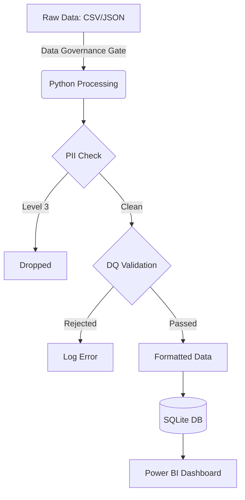

# Spotify Project Pipeline

**1. Source Layer:**
* `data/raw/kaggle_spotify.csv`
* `data/raw/spotify_history_2025.json` (When available)

**2. Processing Layer (Python):**
* **Anonymizer:** Drop Level 3 PII (Email, IP).
* **Validator:** Apply `quality_rules.md` (Drops DQ-01/02/03, Transforms DQ-05/06/07/08/09).
* **Formatter:** Ensure keys are uppercase and dates are correctly typed.

**3. Storage Layer (SQLite):**
* Data is loaded into the `spotify_tracks` table defined in the `schema.sql`.

**4. Presentation Layer (Power BI):**
* Direct connection to the `.db` file for visualization.
